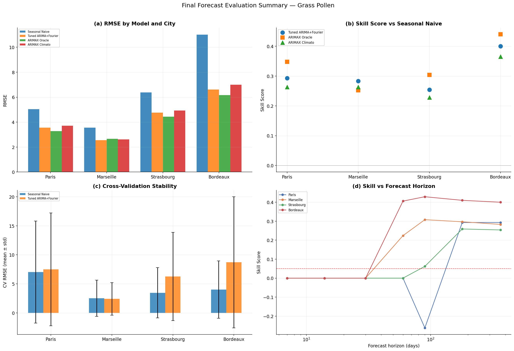

# Beyond Pollen Counts

Time-series modelling of pollen exposure, weather, air quality, and allergic-risk proxies across four French cities.

## Contributors

Jonathan Bouniol, Anna Spira, Keira Chang, Sacha Nardoux, Enzo Natali

## Project Overview

This project studies whether daily pollen concentrations in France can be modelled and forecast with interpretable time-series methods, and whether a composite **Heat-Pollution Index (HPI)** adds useful context for allergenic risk.

The analysis covers four climatically contrasted French cities:

- **Paris** - oceanic/continental urban profile
- **Marseille** - Mediterranean profile
- **Strasbourg** - continental profile
- **Bordeaux** - oceanic profile

The main modelling panel spans **2022-01-01 to 2024-12-31** and combines:

- six pollen species: birch, alder, grass, olive, mugwort, ragweed
- daily weather variables: temperature, precipitation, wind, sunshine, humidity
- air-quality variables: ozone, nitrogen dioxide, PM2.5
- optional health validation using Open Medic / Ameli antihistamine reimbursements (`ATC3 = R06A`)



## Research Questions

1. Can daily pollen concentrations be forecast with statistical time-series models?
2. Are seasonal dynamics homogeneous across French cities with different climates?
3. Do weather and air-quality covariates improve pollen forecasting beyond seasonal structure?
4. Is pollen alone enough to proxy allergic risk, or does a heat-pollution composite index add information?
5. Can long-term weather evolution help contextualize recent pollen and air-quality exposure?

## Key Findings

### Forecasting

- A tuned **ARIMA + Fourier** model is the strongest practical forecasting baseline.
- For grass pollen on the 2024 test set, ARIMA + Fourier reduces RMSE by roughly **25-40%** versus a seasonal naive baseline.
- Weather covariates help mostly in an **oracle** setting where 2024 weather is already known. In a realistic climatological setup, they often add operational complexity without improving forecasts.
- Forecast errors are concentrated during the active pollen season: **98-99% of mean squared error** comes from in-season days.
- Model rankings differ significantly across cities: Friedman test `chi2 = 11.49`, `p = 0.0215`.

### HPI Extension

The project builds a Heat-Pollution Index:

```text
HPI = normalized daily max temperature * mean(normalized ozone, normalized nitrogen dioxide)
```

This index is designed to capture days where heat and pollution co-occur. It is bounded in `[0, 1]`, and high values require both heat and pollution to be elevated on the same day.

Main observations:

- Mean HPI is highest in Marseille (`0.201`), followed by Paris (`0.169`), Bordeaux (`0.157`), and Strasbourg (`0.153`).
- HPI-enhanced ARIMAX variants are informative for diagnosis, but they do not systematically beat the weather baseline: in the exported HPI comparison, the weather-only model remains best in 8 out of 12 city-species cases.
- The strongest value of HPI is interpretability: it identifies high-stress environmental days that pollen-only seasonal models may miss.

### Health Validation

The optional Open Medic notebook links pollen and HPI exposure to monthly reimbursements of systemic antihistamines (`R06A`).

- Pollen exposure shows a clear seasonal association with R06A reimbursements.
- In the current monthly regression setup, adding HPI to pollen changes `R2` from `0.543` to `0.546`.
- The nested F-test is not significant (`p = 0.671`), so this analysis does **not** prove that HPI adds independent explanatory power beyond pollen alone.
- The health layer is therefore treated as an exploratory validation, not as causal evidence.

### Historical Context

The historical notebook separates what can be studied over long and short windows:

- weather: 1980-2024
- air quality: 2013-2024
- recent pollen context: available Open-Meteo pollen window
- main forecasting panel: 2022-2024

Across the four cities, average annual temperature rises from `12.40 C` in 1980-1999 to `13.68 C` in 2020-2024. Hot days increase from `8.1` to `17.2` days per year, while frost days fall from `35.9` to `23.1` days per year.

## Methodology

The project follows a progressive modelling workflow:

1. **Data collection**
   - Fetch pollen and air-quality series from the Open-Meteo Air Quality API.
   - Fetch historical weather from the Open-Meteo Historical Weather API.
   - Resample hourly pollen and air-quality data to daily means.
   - Merge all series on `(date, city)`.

2. **Feature engineering**
   - Fill missing pollen values with zero when absence is biologically meaningful.
   - Compute seasonal pollen integrals (SPIn).
   - Define pollen seasons with a cumulative 5%-95% method.
   - Build lagged weather and HPI covariates.
   - Check multicollinearity with VIF before using exogenous regressors.

3. **Exploratory analysis**
   - Distribution analysis and zero inflation.
   - Seasonal profiles and phenology.
   - Cross-city comparisons.
   - Spearman correlations and lagged cross-correlations.
   - Stationarity tests: ADF and KPSS.
   - ACF/PACF diagnostics and Ljung-Box tests.

4. **Forecasting models**
   - Seasonal naive baseline.
   - ARIMA + Fourier seasonality.
   - ARIMAX + Fourier + lagged weather.
   - Holt-Winters exponential smoothing.
   - VAR exploration for cross-species interactions.
   - Hyperparameter tuning with validation split to avoid test leakage.

5. **Model comparison**
   - 2022-2023 training and 2024 test evaluation.
   - Expanding-window cross-validation.
   - Forecast horizon degradation analysis.
   - Oracle versus climatological weather scenarios.
   - Friedman and Nemenyi post-hoc tests.
   - Error decomposition by phenological phase.

## Notebook Guide

| Notebook | Purpose | Main Outputs |
| --- | --- | --- |
| `Notebooks/01_data_collection.ipynb` | Collect pollen, weather, and air-quality data | `pollen_weather_merged.csv`, `spin_annual.csv`, `spin_monthly.csv` |
| `Notebooks/02_eda.ipynb` | Explore distributions, seasonality, city effects, stationarity, and weather-pollen links | EDA figures, VIF, ACF/PACF, modelling recommendations |
| `Notebooks/03_modelling.ipynb` | Benchmark forecasting models progressively | Seasonal naive, ARIMA + Fourier, ARIMAX, Holt-Winters, VAR |
| `Notebooks/04_forecasting_comparison.ipynb` | Evaluate uncertainty, cross-validation, rankings, and forecast horizons | final comparison table, statistical tests, phase error decomposition |
| `Notebooks/05_hpi_analysis.ipynb` | Build and test the Heat-Pollution Index | `hpi_daily.csv`, `hpi_results.csv`, HPI figures |
| `Notebooks/06_historical_evolution.ipynb` | Contextualize climate and air-quality evolution | weather period summaries and long-term figures |
| `Notebooks/open_medic_2025.ipynb` | Optional health validation with Ameli/Open Medic R06A data | monthly reimbursement analysis |

## Repository Structure

```text
.
|-- CLAUDE.md
|-- README.md
|-- Notebooks/
|   |-- 01_data_collection.ipynb
|   |-- 02_eda.ipynb
|   |-- 03_modelling.ipynb
|   |-- 04_forecasting_comparison.ipynb
|   |-- 05_hpi_analysis.ipynb
|   |-- 06_historical_evolution.ipynb
|   `-- open_medic_2025.ipynb
|-- figures/
|   `-- exported PNG figures
|-- sources/
|   `-- open_medic/
|       `-- optional Ameli/Open Medic source files
`-- Data/
    |-- Raw/
    `-- processed/
```

`Data/`, `tasks/`, and raw Open Medic files are intentionally ignored by Git. They can be regenerated or supplied locally before running the notebooks.

## Data Sources

| Source | Used For | Notes |
| --- | --- | --- |
| Open-Meteo Air Quality API | pollen, ozone, nitrogen dioxide, PM2.5 | hourly data resampled to daily means |
| Open-Meteo Historical Weather API | temperature, precipitation, wind, sunshine, humidity | daily weather panel and 1980-2024 historical extension |
| Open Medic / Ameli | antihistamine reimbursements (`R06A`) | optional health validation; source files must be placed in `sources/open_medic/` |

## Reproducibility

Recommended environment: **Python 3.11+**.

```bash
python -m venv .venv
source .venv/bin/activate
python -m pip install --upgrade pip
pip install jupyter pandas numpy matplotlib seaborn scipy statsmodels scikit-learn pmdarima scikit-posthocs openmeteo-requests requests-cache retry-requests openpyxl
```

Launch the notebooks:

```bash
jupyter notebook Notebooks/
```

Suggested execution order:

1. `Notebooks/01_data_collection.ipynb`
2. `Notebooks/02_eda.ipynb`
3. `Notebooks/03_modelling.ipynb`
4. `Notebooks/04_forecasting_comparison.ipynb`
5. `Notebooks/05_hpi_analysis.ipynb`
6. `Notebooks/06_historical_evolution.ipynb`
7. `Notebooks/open_medic_2025.ipynb` if the Open Medic source files are available locally

## Selected Results

### Grass Pollen Forecasting, 2024 Test Set

| City | Seasonal Naive RMSE | Tuned ARIMA + Fourier RMSE | Skill |
| --- | ---: | ---: | ---: |
| Paris | 5.04 | 3.56 | 0.293 |
| Marseille | 3.56 | 2.55 | 0.283 |
| Strasbourg | 6.38 | 4.76 | 0.254 |
| Bordeaux | 11.01 | 6.61 | 0.400 |

### Oracle vs Realistic Weather

| City | ARIMA + Fourier Skill | ARIMAX Climato Skill | ARIMAX Oracle Skill |
| --- | ---: | ---: | ---: |
| Bordeaux | 0.40 | 0.36 | 0.44 |
| Marseille | 0.28 | 0.26 | 0.25 |
| Paris | 0.29 | 0.26 | 0.35 |
| Strasbourg | 0.25 | 0.23 | 0.30 |

Interpretation: exogenous weather can help when future weather is known, but the simple seasonal model remains the more reliable operational baseline.

## Limitations

- The main modelling window is short: only three complete years.
- Daily pollen series are highly zero-inflated and strongly seasonal.
- Weather and HPI ARIMAX experiments use observed 2024 exogenous values in some comparisons, so these are explanatory or oracle scenarios rather than fully deployable forecasts.
- Health validation is monthly and partially regional, not city-day level.
- HPI is a useful environmental stress indicator, but the current evidence does not establish causal health impact.

## Why This Project Matters

This repository demonstrates an end-to-end applied time-series workflow:

- API-based data acquisition
- data cleaning and reproducible notebook engineering
- statistical EDA
- interpretable forecasting
- rigorous model comparison
- exogenous-regressor testing
- environmental-health framing
- portfolio-ready reporting with exported figures and tables

The final result is not just a forecast model: it is a complete analytical pipeline for understanding when pollen exposure is predictable, where models fail, and how heat and pollution can be integrated into a broader allergenic-risk narrative.
